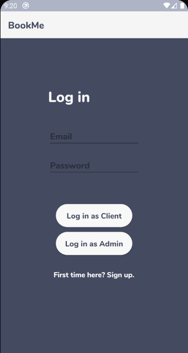
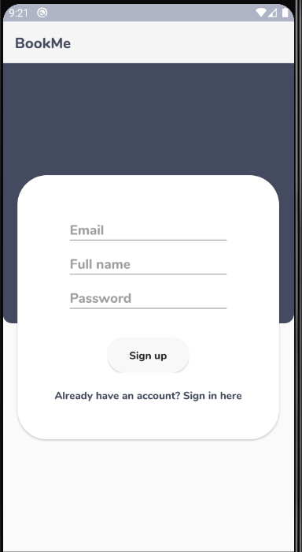
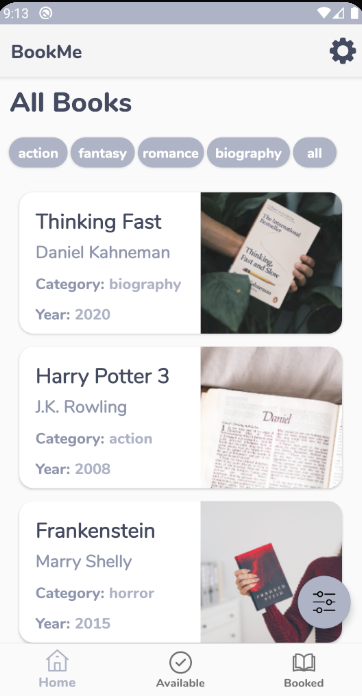
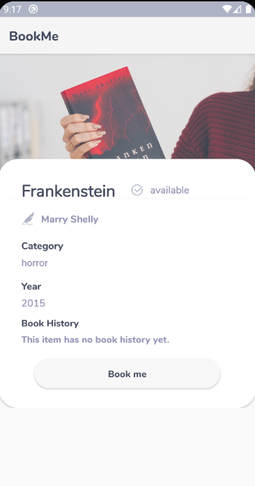
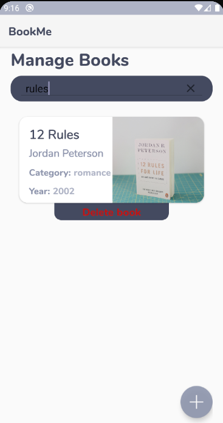
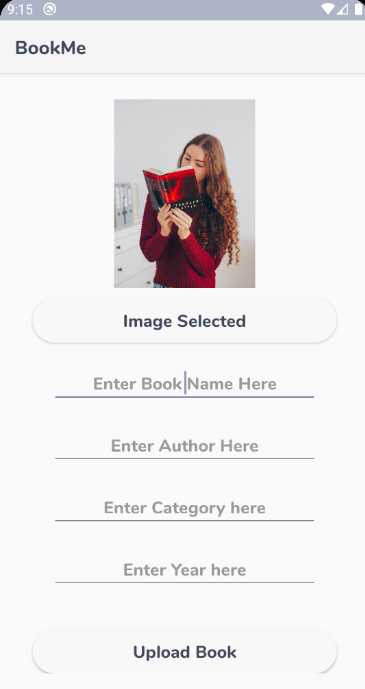

# BOOK-ME

# Team:

- **Developer**: Razvan-Gabriel Iancu

- **Developer**: Nicoleta-Manuela Paraschiv

- **Tester + Dev**: Bianca-Andreea Gheldiu

- **Project Manager + Dev**: Andreea-Daniela Sandru

## Technologies used:

**1. Firebase**:

  - Media Storage: Firebase Storage
  
  - NoSQL Database: Firebase Realtime Database

**2. Android Studio**
 
 
## Chosen theme: **Book Rent App**

 **Basic Functionalities**:
 
 - The page of register will have 3 fields to complete: Email, Full Name and Password.
 
 - The page of log in will have 2 types of buttons: "Log in as Client" which is for client and "Log in as Admin", both with 2 fields: Email and Password.
 
 - Client:
 
    - Once you enter in application, you will see 3 main pages: 
    
        - All Books
        
        - Available Books
        
        - Reserved Books
    
    - All Books and Available Books Pages have some filters to choose the category.
    
    - If you want to book, you need to open the book page and press on button "BookMe" where you'll need to enter an estimated return date. 
    
    - This book will appear in page Reserved Books, and will disappear from page Available Books.
    
    - When you want to return a book, you'll press the "Return book" button on Reserved books page.

    - The book will reappear in page Available Books and dissapear from Reserved Books.
    
    - You can also subscribe to receive notifications when a specific book is returned.
    
    - Pressing the notification will redirect you to the subscribed book page.
    
- Admin:
   
   - There is **a single admin account**
   
   - To enter the app as admin, the user has to enter admin credentials and click the 'Login as Admin' button.
   
   - By doing so, he will have admin rights to all existing books.
   
   - Compared to client users, he will have a "Manage all books option".
    
- Manage All Books option:
 
    - ADD BOOK: book image, name, author, year, category
    
    - SEARCH BOOK by name

    - DELETE  BOOK
   
   
**Main pages:**

- Login, Register and All Books Pages:

  
   
  

- Book, Manage Books and Add Book Pages:

  
  
  

  
